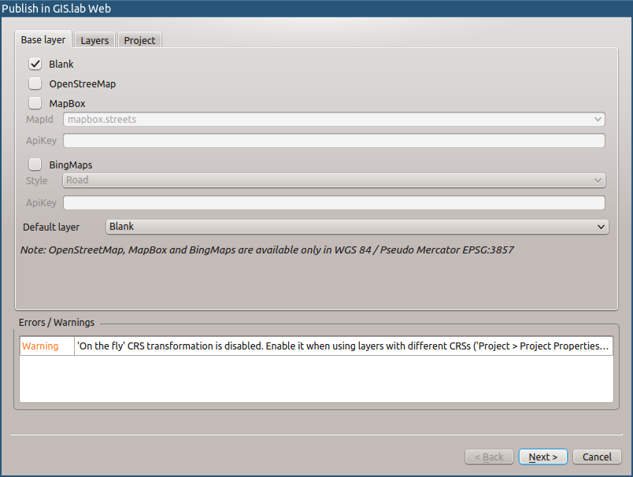
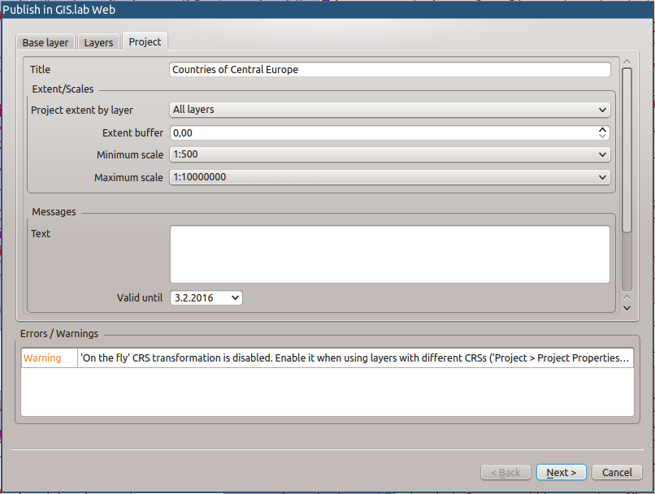
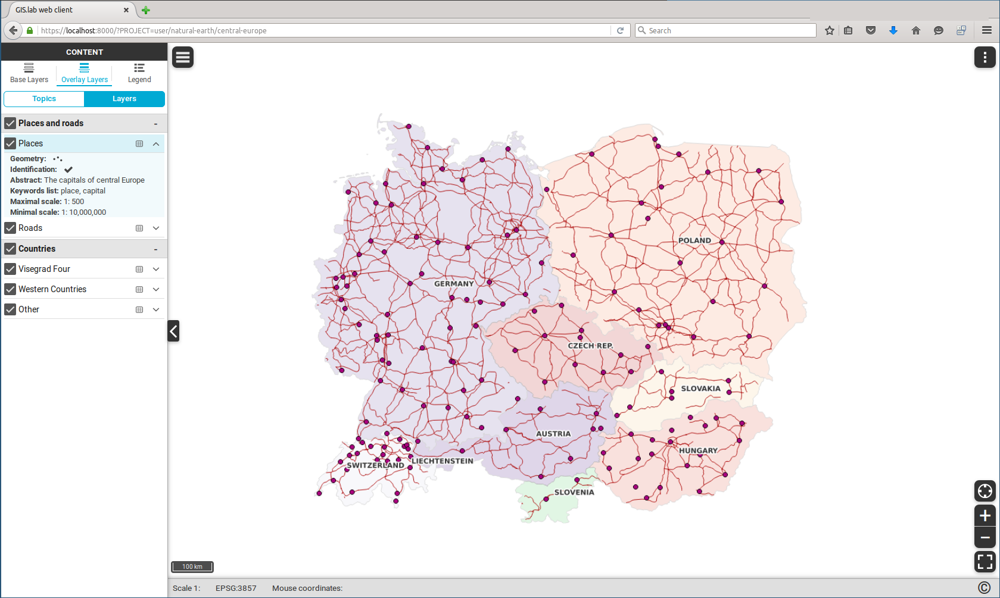
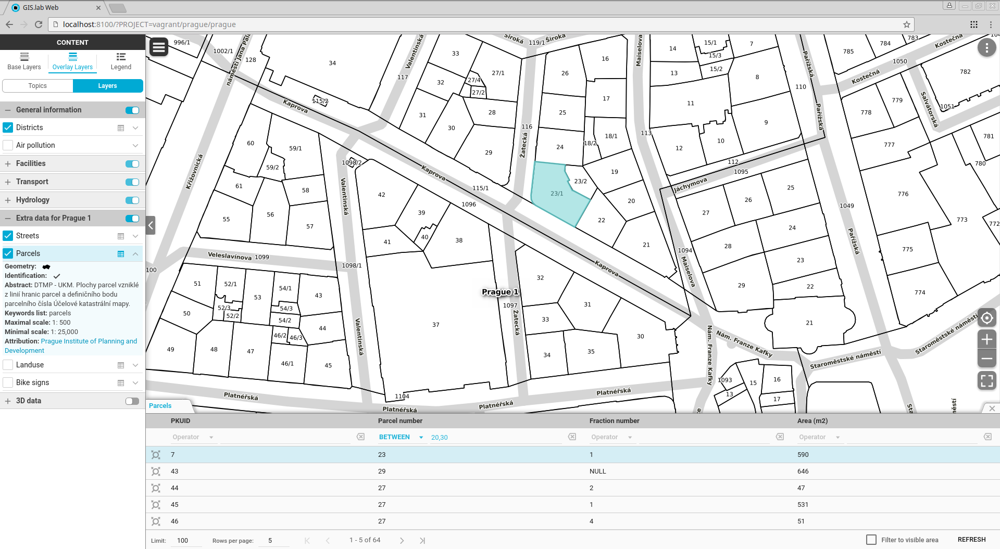
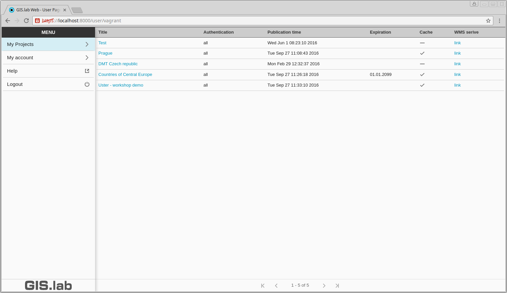

# Gisquick New Generation (in development)
New generation of Gisquick infrastructure for publishing QGIS projects in
Web.


## Features

### Gisquick QGIS plugin

* building Gisquick bundle from any QGIS Desktop project
* adding base layers
* creating topics from layers list
* setting access constraints
* setting project expiration





### Gisquick

* responsive web design
* topics
* base and overlay layers
* legend
* identification (WFS)
* attribute table data filtering (WFS)
* measurement - coordinates, length, area
* print





### Gisquick User Console

* projects and OWS services management
* user account information




### Gisquick Mobile

TODO: screenshot

* dedicated hybrid Android client interface built on top of the same code base
  as web inteface with native UI


### Tiles cache
* built-in automatic tiles caching


## Technologies
* QGIS Desktop and Mapserver
* OpenLayers 3
* AngularJS, Angular Material
* Onsen
* Cordova
* Django
* Python


## Source code layout
* **clients:**    web and mobile client interfaces
* **server:**     Django server
* **qgis:**       QGIS plugin
* **provision:**  development environment provisioning configuration
                  (Vagrant/Ansible)
* **dev:**        development directory
* **dev/django:** directory for Django development project created during
                  provisioning
* **dev/publish:** directory for QGIS projects publishing


## Development environment
**Dependencies:**  
* Linux or Mac
* Git
* VirtualBox
* Vagrant
* Ansible 2

**Creating development environment:**  
* clone source code with Git
```
$ git clone https://github.com/gislab-npo/gislab-web.git
```

* optionaly enable Gisquick Mobile by adding configuration variable to
  'provision/host_vars/gislab-web' file
```
GISQUICK_CLIENT_MOBILE: yes
```

* start development environment (run in source code root directory)  
  *Note: to speed up provisioning using Apt proxy server, set APT_PROXY variable
  before running this command ($ export APT_PROXY=http://192.168.99.118:3142).
  See [Apt Cacher server](https://github.com/gislab-npo/gislab/wiki/Apt-Cacher-server) instructions for details.*
```
$ vagrant up
```

* log in to virtual machine (run in source code root directory)
```
$ vagrant ssh
```

* start development services (run in virtual machine)
```
$ /vagrant/utils/tmux-dev.sh
```

* enter URL below in web browser to launch Gisquick
```
https://localhost:8000?PROJECT=vagrant/natural-earth/central-europe
```

* to quit type 
```
$ tmux kill-session
$ vagrant halt
```

**Other commands:**  
* run server tests (run in '/vagrant/dev/django' dir)
```
$ python ./manage.py test webgis.viewer.tests
```


**Other information:**
* QGIS Mapserver is also forwarded to host machine on port 8090
* QGIS Mapserver logs can be found in '/var/log/lighttpd' directory


**Workflow:**
* install QGIS Gisquick plugin
```
$ ln -s $(pwd)/qgis/gisquick  ~/.qgis2/python/plugins/gisquick
```

* create project in QGIS Desktop

* run QGIS Gisquick plugin wizard from 'Web > Gisquick' to publish QGIS
  project

* copy published QGIS project with all associated data to 'dev/publish'
  directory

* open Gisquick User Console and launch published project in Gisquick
  interface


## Packaging
*TODO: add instructions how to clean environment before build*

* Gisquick QGIS plugin
```
$ cd /vagrant/qgis/gislab_web \
  && \
  make clean \
  && \
  make compile \
  && \
  make zip
```

* Gisquick
```
$ cd /vagrant/server \
  && \
  python ./setup.py sdist
```

* Gisquick Mobile
```
$ nvm use stable

$ export ANDROID_HOME=/home/vagrant/dev/apps/android-sdk-linux \
         PATH=$PATH:/home/vagrant/dev/apps/android-sdk-linux/tools:/home/vagrant/dev/apps/android-sdk-linux/platform-tools \
         ANDROID_BUILD=ant \
  && \
  cd /vagrant/clients/mobile/cordova-app \
  && \
  cordova build android
```

## License
GNU General Public License version 2 or later.
